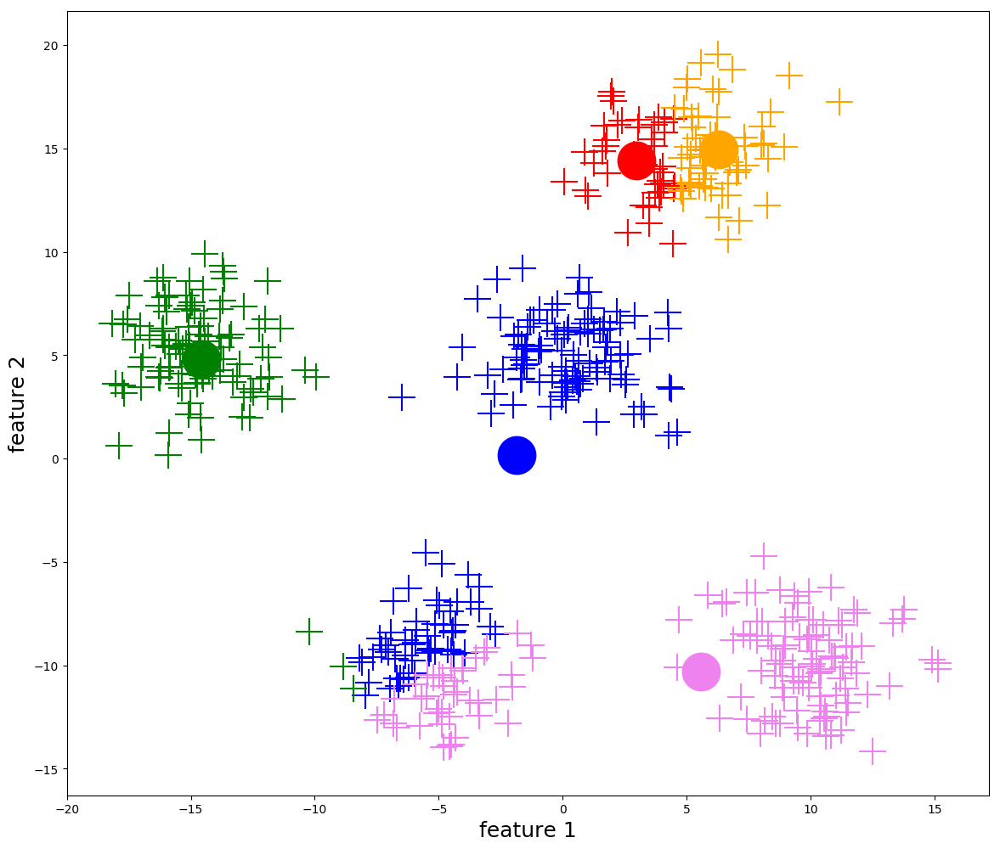
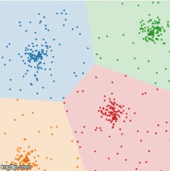
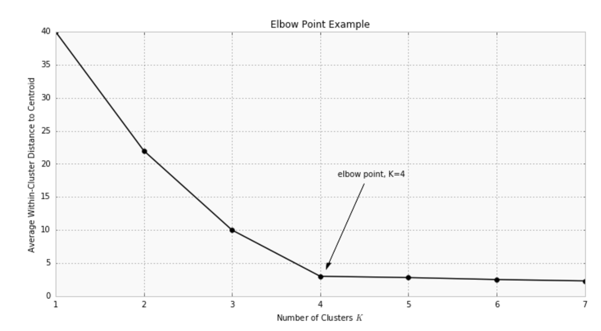
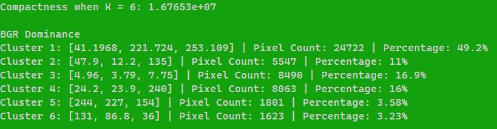

# Colour Capture - STEM 11 Capstone Alpha

This article will aim to summarize our program as means of showcasing what we have learnt over the span of three weeks. In addition, it will serve to compliment the poster if questions are present.

Table of Content:

1. Project Summary
2. Using OpenCV for image analysis & Excel File
3. K-Means Clustering & Elbow Point
4. Colour Capture/Quantization


## Project Summary

The goal of this project is to analyze images using OpenCV, displaying colour data with graphs and a colour palette of prominent colours that will determine optimal results. Functions such as `kmeans()` and `imread()` are used extensively to do such and will be explained in detail. 


## OpenCV for Image Analysis & Writing to Excel File
Before diving into K-Means Clustering, let's talk about image analysis. In order to analyze image data, we used OpenCV's wide library for computer vision (artifical inteligence). 

```
Mat src;
 
std::string image_path = samples::findFile("C:/Users/Francis/Documents/images/mario.jpg");

src = imread(image_path, IMREAD_COLOR);
```

We can simply access an image by initializing class variable `src` to the image path, using function `imread()` to read the file. The `mat` class is used for matrixes (arrays).
```
cout << "Select x pixel coordinate:\n";
        cin >> x;
        cout << "X: " << x << "\nSelect y pixel coordinate:\n";
        cin >> y;
        cout << "X: " << x << " | Y: " << y << "\n\n\n\n";

        Vec3b intensity2 = src.at<Vec3b>(x, y);
        b = intensity2.val[0];
        g = intensity2.val[1];
        r = intensity2.val[2];

```
By using the `.at` function which returns a reference to the specified array element (in this case, 'x' and 'y'), we are able to grab BGR (blue, green, red) values by calling seperate array indexes. (Vec3b is a vector with 3 byte entries, with each representing each single color channel.)

Now that we are able to access colour data from the image, we can write to an Excel file by using the `fstream` library found in C++.

```
#include <fstream>

...

ofstream outData;

outData.open("CapstoneExceltest.csv", ios::app); // opens the Excel file

outData << intensity2.val[0] << "," << intensity2.val[1] << "," << intensity2.val[2] << endl; //outputs BGR to Excel
```

Learning how to retrieve colour data from an image and to write to an Excel file will serve us well when implimenting the next step: K-Means Clustering.

## K-Means Clustering

As humans, looking at an image and determining which colours are prominent within an image is simple. For machines, doing such a task requires artificial intelligence. Therefore, we decided to use K-Means Clustering as our "go-to" algorithm.

K-Means Clustering is the process of partitioning data points into k clusters in reference to a centroid, or the center point of the cluster (the mean of all data points). Whilst complicated at first, the steps it takes are linear in fashion:

1. Centroids are randomly placed. The number of centroids (K) used is up to the user. Refer to Elbow Point and Colour Quantization to determine optimal K value.
2. Each data point is intialized to its closest centroid using euclidean distance.
3. Determine where the new centroid would be in the cluster by finding the mean of a cluster.
4. Repeat steps 2-3 until movement has ceased. 



(refresh page to see animation)

Because of this, K-Means Clustering can be used to organize BGR data into colour clusters, albeit in a three dimension space (BGR... right?). Luckily, OpenCV has a function dedicated to K-means clustering!

```
double compactness = kmeans(data, k, labels, TermCriteria(TermCriteria::MAX_ITER, 10, 1.0), 3, KMEANS_PP_CENTERS, centers);
```
https://docs.opencv.org/4.x/d1/d5c/tutorial_py_kmeans_opencv.html

`kmeans()` has three output parameters which are of **great importance**: compactness, labels, and centers.

- Compactness refers to the sum of squared distance from each point to their centroid within each cluster. 
- Labels is an array which initalizes each pixel as "0", "1", "2"... depending on which cluster it is inside. 
- Centers is simply the center of clusters. 
- (The other input parameters are used to determine when to stop the algorithm, how many clusters (K), etc...)

With this in mind, we can finally determine the optimal k value with these parameters.

### Elbow Method (data analysis)

In the gif above, it is obvious to the human that there are five clusters present. Therefore, when we have to input a k value into 'kmeans()', we can simply make initialize 'k = 5' and retrieve good results. However, if we had to work with data with myriads of clusters (such as an image), it would be a pain to count each and every one of these clusters! How will we be able to find the optimal k value?

One way of finding the optimal k is the elbow method. If we were to compare compactness to k on a graph, there will be a decrease in compactness as we increase the amount of centroids used.




In the examples above, we can determine the optimal k by finding the "elbow" point of the data line. The elbow point can be defined as the point before the compactness starts to level out or decrease in difference. This will be important once we impliment 'kmeans()' into our colour program.


## Colour Capture

It's time to merge all the forces into one program!


```
    Mat labels, centers;
    Mat data;
    int k = 10; // example
    src = imread(image_path, IMREAD_COLOR);
    src.convertTo(data, CV_32F); //convert the data to CV_32F (float) between the range of 0-1.0 to ease kmeans().

    
    data = data.reshape(1, data.total()); //the matrix will only have one channel.

    double compactness = kmeans(data, k, labels, TermCriteria(TermCriteria::MAX_ITER, 10, 1.0), 3, KMEANS_PP_CENTERS, centers);
    
    
    // reshape both to a single row of Vec3f pixels.
    centers = centers.reshape(3, centers.rows);
    data = data.reshape(3, data.rows);

    // replace pixel values with their center value:
    Vec3f* p = data.ptr<Vec3f>();
    for (size_t i = 0; i < data.rows; i++) {
        int center_id = labels.at<int>(i, 0);


        p[i] = centers.at<Vec3f>(center_id);
    }

    src = data.reshape(3, src.rows);
    src.convertTo(src, CV_8U); //convert data back to CV_8U between the range of 0-255 for BGR values.

    std::cout << "Compactness when K = " << k << ": " << compactness << endl; // print compactness and k.

    //visualize data:
    imshow("Image", src);
    printColour(centers, labels, data);

```


In order to print a colour palette...
```

Mat printColour(const Mat& centers, const Mat& labels, const Mat& data, int siz = 64) { //pass Mat variables as parameters

    Mat cent = centers.reshape(3, centers.rows);

    // make  a horizontal bar of K color patches:
    Mat draw(siz, siz * cent.rows, cent.type(), Scalar::all(0));

    cout << endl << "BGR Dominance\n";
    for (int i = 0; i < cent.rows; i++) {
        // set the resp. ROI to hat value (just fill it):
        draw(Rect(i * siz, 0, siz, siz)) = cent.at<Vec3f>(i, 0);

        double numerator = static_cast<float>(countNonZero(labels == i));
        double denominator = static_cast<float>(data.total());

        double percentage = numerator / denominator;


        cout << "Cluster " << i + 1 << ": " << cent.at<Vec3f>(i, 0) << " | Pixel Count: " << countNonZero(labels == i) << " | Percentage: " << std::setprecision(3) << percentage * 100.0 << "% \n";
        

    }
    
    draw.convertTo(draw, CV_8U); //convert draw data to CV_8U

    //visualization
    imshow("Colour Palette", draw);
    waitKey();
    
    cout << "-----------------\n";
    return draw;
}

```

Output:





## Colour Quantization
//remind to show borat.


Whenever you commit to this repository, GitHub Pages will run [Jekyll](https://jekyllrb.com/) to rebuild the pages in your site, from the content in your Markdown files.

### Markdown

Markdown is a lightweight and easy-to-use syntax for styling your writing. It includes conventions for

```markdown
Syntax highlighted code block

# Header 1
## Header 2
### Header 3

- Bulleted
- List

1. Numbered
2. List

**Bold** and _Italic_ and `Code` text

[Link](url) and 
```

For more details see [Basic writing and formatting syntax](https://docs.github.com/en/github/writing-on-github/getting-started-with-writing-and-formatting-on-github/basic-writing-and-formatting-syntax).

### Jekyll Themes

Your Pages site will use the layout and styles from the Jekyll theme you have selected in your [repository settings](https://github.com/MaestroFries/FinalCapstoneAlpha/settings/pages). The name of this theme is saved in the Jekyll `_config.yml` configuration file.

### Support or Contact

Having trouble with Pages? Check out our [documentation](https://docs.github.com/categories/github-pages-basics/) or [contact support](https://support.github.com/contact) and we’ll help you sort it out.
